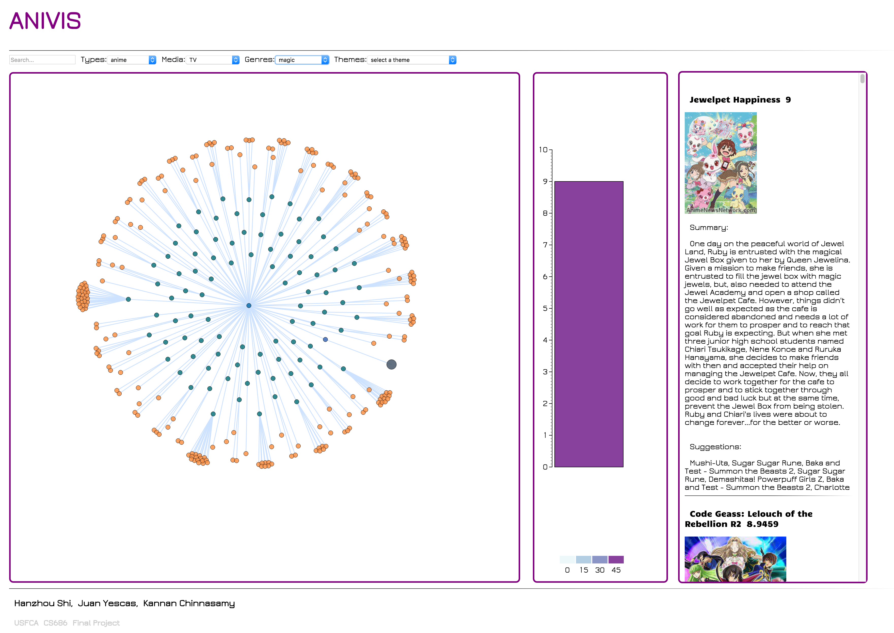

# ANIVIS

## Link

Click [here](http://hanjoes.github.io/anivis/) to start exploring animes.

## About This Repo

I organized this repo partly because I looked at [this repo](https://github.com/sxywu/wongfu) and some parts of it made a lot of sense to me.

This repository is organized into two parts:

### API

All the python scripts used to pull data from data source, and clean the data to get the JSON format our visualization is using.

### Web

This is the folder contains the implementation of our app.

#### Build

This project is using [NPM](https://www.npmjs.com/) as the dependency manager, in most cases, you should be able to run

`
npm init
`

and then,

`
npm install
`

To get all the packages needed to build the app. But in case of incompatibility on some platforms, you can manually install the packages by following the error messages.

Suppose you've installed all the dependencies successfully, to build the web folder, just navigate to the folder and type:

`
webpack
`

This will compile all the jsx files and ES6 code into Javascript code runnable on most mainstream browsers. After build, you can start your favorite web-server from **web** folder. I usually use python's SimpleHTTPServer module (**suppose running python 2.7**) so I will type:

`
python -m SimpleHTTPServer 8000
`

And open the browser with url: http://127.0.0.1:8000 will show you the visualization.

#### Source

The source of the website is *clearly* divided in to modules. Except for the mundane **css** and **index.html** files, all of our source is under the **js** folder. And if you take a closer look, you will see three parts:

* **Actions** - Which define all the data related APIs. This is the interface that actually fetches the data.
* **Components** - This is all the react module, if you have some knowledge about react, you can discern the tree structure in it (App.jsx as the root).
* **Utils** - This is where I put all the utility functionalities that are shared across the codebase.

And of course, there is the _main.js_ serves as the entry point for the whole app.

### Docs

This folder contains all the paperworks, from presentation slides to our process book.

## Non-Obvious Features

### RankingView

This might be a little confusing at first when you are looking at it. Basically the ranking view is the rectangle bar to the right of the force layout tree. It supports one interaction which is clicking to break down. If the range can be divided, you will see the rectangle being divided into two smaller rectangles. This view easily shows user ranking distribution, and at the meantime it narrows down the search range for a specific category (meaning there are less animes shown in the detail view).

### Interactions for the Force Layout

Left mouse button click is the most straightforward interaction uses might think of to interact with Force Layout. And yes it is supported in our vis! You could use left mouse button to expand/collapse nodes and drag nodes around, **but there is one thing I also need to mention:** You could also shift+click on one of the nodes which is an anime to reveal the detailed information about it. Adding shift as the modifier key is because I want to avoid ambiguity with simple left mouse button click.
